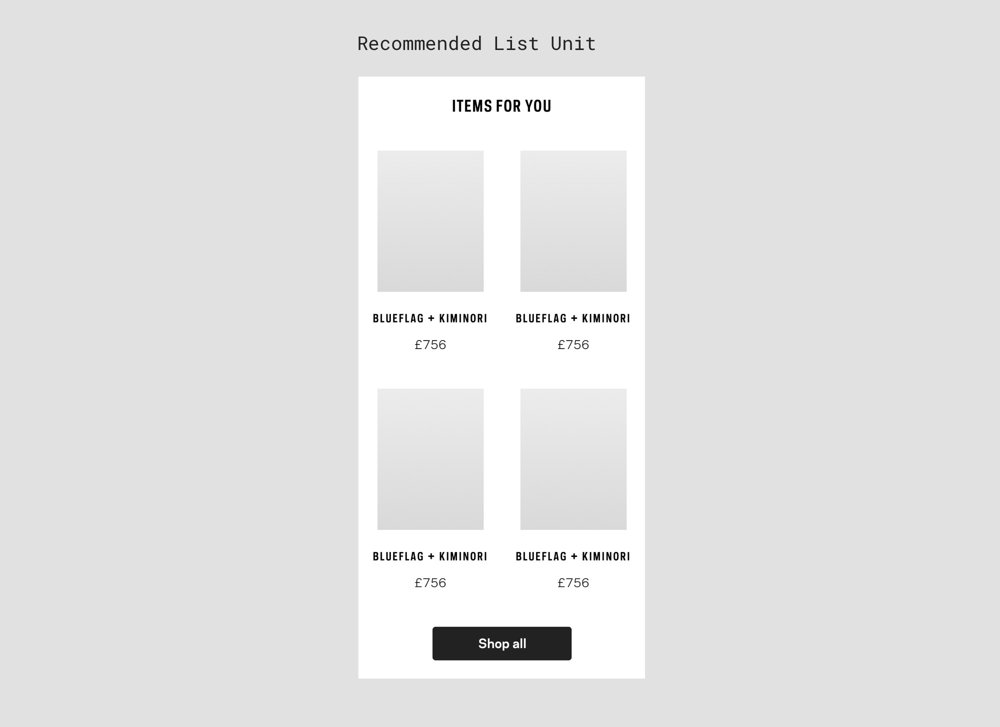

# FFKit — Mobile Prototyping Kit [](readme-name-id)

### v1.0.2 [](version-id)

### Table of contents [](toc-id)

-   [Get Started](#Get-Started)
    -   [Installation](#Installation)
    -   [Snippets](#Snippets)
    -   [Master UI views in Design Mode](#Master-UI-views-in-Design-Mode)
    -   [Configuration](#Configuration)
    -   [Sizes variables](#Sizes-variables)
    -   [Type styles](#Type-styles)
-   [Components](#Components)
    -   [StatusBar](#StatusBar)
    -   [Buttons](#Buttons)
    -   [Header](#Header)
    -   [ProductCard](#ProductCard)
    -   [List Product Card](#List-Product-Card)
    -   [ProductSlider](#ProductSlider)
    -   [Tabbar](#Tabbar)
    -   [Pos Banner](#Pos-Banner)
    -   [List title](#List-title)
    -   [List Item](#List-Item)
    -   [List Radio Select](#List-Radio-Select)
    -   [iOS Switch](#iOS-Switch)
    -   [Keyline](#Keyline)
    -   [Selector](#Selector)
    -   [Me — Contact Us](#Me-—-Contact-Us)
    -   [Me — Sign In](#Me-—-Sign-In)
    -   [Button Fixed](#ButtonFixed)
    -   [Accordion](#Accordion)
    -   [AccordionGroup](#AccordionGroup)
    -   [Refine filter](#Refine-filter)
    -   [ActionSheet](#ActionSheet)
    -   [Input](#Input)
    -   [FFInput](#FFInput)
    -   [Tabs](#Tabs)
    -   [Search Input](#Search-Input)
-   [Units](#Units)
    -   [Hero Unit](#Hero-Unit)
    -   [Product Unit](#Product-Unit)
    -   [Feature Unit](#Feature-Unit)
    -   [Product Set](#Product-Set)
    -   [Product Hero](#Product-Hero)
    -   [Product Listing Unit](#Product-Listing-Unit)
    -   [PDP Hero Unit](#PDP-Hero-Unit)
    -   [Recommended List Unit](#Recommended-List-Unit)
    -   [SearchUnit](#SearchUnit)
    -   [WishlistUnit](#WishlistUnit)
    -   [GenderSwitch](#GenderSwitch)
-   [Pages](#Pages)
    -   [Designers Page](#Designers-Page)
    -   [Categories Page](#Categories-Page)
-   [Functions](#Functions)
    -   [Global Functions](#Global-Helper-Functions)
    -   [Private Functions](#Private-Helper-Functions)
    -   [Design Helper Functions](#Design-Helper-Functions)
-   [Other](#Other)
    -   [FFScrollComponent](#FFScrollComponent)

---

## Get Started

### Installation

Download the lates version of `FFKit.framer` rename the project if you need to.
When you open it Framer Studio, you'll see:

```coffeescript
FFKit = require("FFKit").setup()
```

This line loads all the modules from the kit to your Framer project.


### Upload to Framer Cloud

To be able to share you projects to Framer Cloud you might need to udpate Project ID.
You can find current Project Id in `frame/config.json` 

Modify one of the last numbers, or copy new project id from a new Framer project file. 

### Snippets


We have code snipets for every component from the Prototyping Kit. You can find the our snipets in `modules/FFKit/snippets` or download it from here: [Link](#)

Copy paste the `FFKit snippets` folder to your Framer snipet folder.

To learn more about snipets check out: [How to use Framer Snippets Library](https://blog.framer.com/how-to-use-framer-snippets-library-27995cc7850b)

### Master UI views in Design Mode

We use Framer's Design Mode to control the basic view of most of our components. We are planing to move this `master` views to an external file in future, but for now we are going to keep them here. Please to not delete or rename anything in the `master` views.

Feel free to use the rest of design mode as you would do nornally.

### Configuration

You won't need to touch the configs unless you are building new components for the Kit.

#### FFKit.cofee

Located in `modules/FFKit/`

This file initialises the Prototyping Kit module by module. Allows dissabling individual modules.

#### Setup.cofee

Located in `modules/FFKit/setup/`

Sets all default requerements and configurations for the Kit including:

-   Fonts
-   Sizing varriables
-   Global functions
-   External Image Settings

##### External Images

Components such as `ProductCards` support JSON datasets exported from our API. However for quicker performanse we have desabled loading of external images by default. Setting bellow allows you to toggle this configuraiton.

```coffeescript
window.useExternalImages = false
```

When set to `false` external product images will be replaced with randomised selection of product images defined in `setup.cofee` you can also find additional configurations for images.

### Sizes variables


In Design mode FFKit has sizes variables. You can use them in Code mode like this L_size, M_size, S_size, XS_size, XXS_size, XXXS_size

#### Usage 🚀

```coffeescript
layerA = new Layer
    y: M_spacer
    x: S_spacer
```

---

### Type styles


#### Usage 🚀

```coffeescript
text1 = new FFTextLayer
    textStyle: "XLBold"
    text: "XLarge — 26 Bold"
    y: 100
    x: M_spacer

text2 = new FFTextLayer
    textStyle: "LBold"
    text: "Large — 18 Bold"
    y: text1.maxY + M_spacer
    x: M_spacer

text3 = new FFTextLayer
    textStyle: "L"
    text: "Large — 18 Book"
    y: text2.maxY + M_spacer
    x: M_spacer

text4 = new FFTextLayer
    textStyle: "MCond"
    text: "Medium — 14 Condenced"
    y: text3.maxY + M_spacer
    x: M_spacer

text5 = new FFTextLayer
    textStyle: "MBold"
    text: "Medium — 15 Bold"
    y: text4.maxY + M_spacer
    x: M_spacer

text6 = new FFTextLayer
    textStyle: "M"
    text: "Medium — 15 Book"
    y: text5.maxY + M_spacer
    x: M_spacer

text7 = new FFTextLayer
    textStyle: "SBold"
    text: "Small — 12 Bold"
    y: text6.maxY + M_spacer
    x: M_spacer
```

---

## Components

### StatusBar


FFKit includes a status bar component. It has two color modes and automaticly can switch a design from iPhoneX and iPhone 8/7/6 or lower.

#### Properties ⚙️

-   `updateTime` enable updating time in a status bar. Could be `true` or `false`
-   `signalIcon`, `wifiIcon`, `batteryIcon` servise icons. To change them just place your SVG icons inside the component folder "assets" and type the name for each one.

#### Methods **()**

`StatusBar.switchMode( transition_time )` this method detects a current colour mode (dark or light) and switches it by inverting colours. You also able to set a transition time between modes.

#### Usage 🚀

```coffeescript
# StatusBar minimum require
status_bar = new StatusBar

# StatusBar all properties
status_bar = new StatusBar
   signalIcon: "signal"
   wifiIcon: "wifi"
   batteryIcon: "battary"
   backgroundColor: "#f45"
   updateTime: true

status_bar.switchMode(0.2)
```

---

### Buttons


Button component contains all buttons types and connected with buttons in Design mode. Four similar types

-   Primary button
-   Secondary button
-   Tertiary button
-   Flat button

These types of buttons have a default width which you can adjust in Design mode.

-   Tag button

Unlike other buttons this type has auto-width.

All buttons also could be extended by an icon. An icon aligned by default to the right side but, also, can be aligned to the left side.

#### Properties ⚙️

-   `type` by this property you can choose next button types `primary`, `secondary`, `tertiary`, `flat` and `tag`
-   All basic properties like `width`, `bbackgroundColor` etc., this component takes from Design mode, so, you are free to change them in Design mode or by code.
-   `text` Change default text for a button
-   `icon` all icons should be stored in the root assets/icons folder. Just type the name like `icon: "arrow-left"`
-   `iconAlign` so far has only one option `left`. This option will align an icon to the left (depends on icon)
-   Another properties only for a tag button `sidePaddings` and `iconMargin` to control side paddings and margin between an icon and a text in the button — you can't change it in Design Mode

#### Usage 🚀

```coffeescript
# Minimum require
# Will switch by default to "Primary"
btn = new Button

# All modifications
btn = new Button
    type: "primary"
    text: "Hello!"
    x: Align.center()
    y: 100

btn2 = new Button
    type: "secondary"
    text: "Yo!"
    icon: "arrow-right"
    x: Align.center()
    y: btn.maxY + M_spacer # Variables

btn3 = new Button
    type: "tag"
    text: "This is awesome"
    x: Align.center()
    y: btn2.maxY + M_spacer

btn4 = new Button
    type: "tag"
    text: "This is awesome"
    icon: "cross"
    iconAlign: "left"
    x: Align.center()
    y: btn3.maxY + M_spacer

btn5 = new Button
    type: "primary"
    text: "Hello!"
    x: Align.center()
    icon: "arrow-left"
    iconAlign: "left"
    y: btn4.maxY + M_spacer

btn6 = new Button
    type: "tag"
    text: "This is awesome"
    icon: "cross"
    x: Align.center()
    sidePaddings: 12
    y: btn5.maxY + M_spacer

btn7 = new Button
    type: "tertiary"
    text: "This is awesome"
    x: Align.center()
    y: btn6.maxY + M_spacer
```

---

### Header


Component creates all possible variations of header in the app.

#### Properties ⚙️

-   `title` — text value, or `"logo"` will load Farfetch logo
-   `subTitle` — text value
-   `iconLeft` — SVG icon name. Example: `"big-arrow"`
-   `iconRight` — SVG icon name. Example: `"bag"`
-   `linkLeft` — text value
-   `linkRight` — text value
-   `bag` — number
-   `search` — boolean Example: `true`
-   `nobg` — boolean Example: `true`

#### Usage 🚀

Example 1: App home screen header

```coffeescript
header1 = new Header
    title: "logo"
    iconRight: "bag"
```

Example 2: Typical page header

```coffeescript
header2 = new Header
    title: "Hello World"
    iconLeft: "big-arrow"
    iconRight: "bag"
    search: true
```

Example 3: PLP Header with bag showing 2 items

```coffeescript
header3 = new Header
    title: "Alexander MqQueen"
    subTitle: "1500 items"
    iconLeft: "big-arrow"
    iconRight: "bag"
    bag: 2
    search: true
```

Example 4: Refine filters header

```coffeescript
header4 = new Header
    title: "Refine"
    iconLeft: "cross"
    linkRight: "Clear All"
```

Example 5: PDP Header

```coffeescript
header4 = new Header
    iconLeft: "big-arrow"
    iconRight: "bag"
    search: true
    nobg: true
```

---

### ProductCard


This is a base component for some units, also it's a base component for the Product Slider component.

#### Properties ⚙️

-   `cover` image for the card.
-   `brandText` brand subheader text.
-   `descriptionText` description text.
-   `priceText` price text below description text.

#### Usage 🚀

```coffeescript
# ProductCard minimum require
productCardA = new ProductCard

# ProductCard all properties
productCardA = new ProductCard
    cover: "modules/FFKit/content/default/products/women/02.jpg"
    brandText: "C&C"
    descriptionText: "Embellished logo denim jacket"
    priceText: "£1256"
```

---

### List Product Card


This is a base component for some units, also it's a base component for the Product Listing Unit.

#### Properties ⚙️

-   `cover` main image.
-   `season` "New Season" by default.
-   `brand` brand subheader text.
-   `icon` "wishlist" by default. Could be `true` or `false`
-   `description` product description text. Could be `true` or `false`
-   `price` string, must include currency sign.
-   `border` — Could be `true` or `false`

#### Usage 🚀

```coffeescript
# Tabbar example
listCard = new ListProductCard

# All propertties
listCard = new ListProductCard
    cover: $+"default/list-product-card-01.png"
    season: ""
    brand: "Dvf Diane Von Furstenberg"
    icon: "wishlist"
    description: "The Large Rucksack in Technical Nylon and Leather"
    price: "£239"
```

---

### ProductSlider


This is a base component for some units. This component allows you create a product list builds on ProductCard component. Also this component conttains buttton-card "Show more".

#### Properties ⚙️

-   `array` cards amount and all properties for ProductCard you can pass through an array.
-   You can also reach all layers inside components like this `productSliderA.showMoreCard`

#### Usage 🚀

```coffeescript
# Minimum require
productCardA = new ProductSlider

# With array
productCardB = new ProductSlider
    array: [
        { # Product 1
        "shortDescription": "I heart Prada bag charm"
        "images": ["url": "https://cdn-images.farfetch-contents.com/12/65/74/91/12657491_12339825_300.jpg"]
        "brand": {"name": "Prada"},
        "price": "£ 135"
        }
        { # Product 1
        "shortDescription": "I heart Prada bag charm"
        "images": ["url": "https://cdn-images.farfetch-contents.com/12/65/74/91/12657491_12339825_300.jpg"]
        "brand": {"name": "Prada"},
        "price": "£ 135"
        }
    ]
```

---

### Tabbar


Base component for navigation in the app between sections.
Can adapt to iPhoneX based on Framer device selected.

#### Properties ⚙️

-   `activeItem` sets up an active item by its name.

#### Children

Can be used to add events via `selectChild()`

-   `home`
-   `search`
-   `wishlist`
-   `me`

#### Usage 🚀

```coffeescript
# Tabbar example
tabbar = new Tabbar
    activeItem: "home"

# Change active item
tabbar.activeItem = "shop"

# Add event
tabbar.selectChild("home").on Events.Click, (event, layer) ->
    print "Clicked Home", layer.name
```

---

### Pos Banner


Basic Point Of Sale banner

#### Properties ⚙️

-   `text` text for the banner

#### Usage 🚀

```coffeescript
pos = new PosBanner
    text: "Private Sale"
```

---

### List title


#### Properties ⚙️

-   `text` text

#### Usage 🚀

```coffeescript
listTitle = new ListTitle
    text: "Hello Word"
    y: 50
```

---

### List Item


#### Properties ⚙️

-   `text` text
-   `right` right icon
-   `flag` left flag icon
-   `line` line type — "fullwidth"
-   `leftTop: "fullwidth"` top line
-   `type: "wide"` switches types

#### Usage 🚀

List items variations

```coffeescript
listTitle = new ListTitle
    text: "Hello Word"
    y: 50

listItem1 = new ListItem
    text: "Hello World"
    right: "arrow-right"
    y: listTitle.maxY
    type: "wide"

listItem2 = new ListItem
    text: "Hello World"
    y: listItem1.maxY

listItem3 = new ListItem
    text: "Hello World"
    right: "arrow-right"
    flag: "uk"
    y: listItem2.maxY
    type: "wide"

listItem4 = new ListItem
    text: "Hello World"
    right: "toggle"
    y: listItem3.maxY
    type: "wide"

listItem5 = new ListItem
    text: "Hello World"
    line: "fullwidth"
    lineTop: true
    y: listItem4.maxY


listItem6 = new ListItem
    text: "Hello World"
    line: false
    lineTop: "fullwidth"
    y: listItem5.maxY
```

---

### List Radio Select


Creates Radio Buttons list

#### Properties ⚙️

-   `text` text
-   `on` in array — `true` or `false`

#### Usage 🚀

```coffeescript
radioSelect = new ListRadioSelect
    selectArray: [
        {text : "List Item 1"},
        {text : "List Item 2", on: true}
        {text: "List Item 3"}
    ]
```

---

### iOS Switch


You can use it separetly or with a ListItem

#### Properties ⚙️

-   `isOn` true or false

#### Usage 🚀

```coffeescript
# Only Swither
toggle = new iOSSwitch
    y: Align.center
    isOn: true

# With ListItem
listItem4 = new ListItem
    text: "Hello World"
    left: "toggle"
    y: 250
```

---

### Keyline


#### Usage 🚀

```coffeescript
line = new Keyline
    y: 100 # position the line
```

---

### Selector


#### Properties ⚙️

-   `placeholderText` text inside
-   `labelText` label text
-   `helperText` text below the input
-   `value` input value

#### Usage 🚀

```coffeescript
# Selector
selector = new Selector
    placeholder: "Select sdf your size"
```

---

### Me — Contact Us


#### Usage 🚀

```coffeescript
contactUs = new MeContactUs
```

---

### Me — Sign In


#### Usage 🚀

```coffeescript
signIn = new MeSignIn
```

---

### ButtonFixed


This component has two modes for iPhone X and for older models — detects automatically. Always sticks to the bottom.

#### Usage 🚀

```coffeescript
addToBag = new AddToBagButton
```

---

### Accordion


This component has two modes for iPhone X and for older models — detects automatically. Always sticks to the bottom.

#### Properties ⚙️

-   `expanded` true or false
-   `labelText` text
-   `content` paste your targeted frame from Design mode

#### Usage 🚀

```coffeescript
# Accordion example
accordionA = new Accordion
    expanded: true
    labelText: "Description"
```

With your own content

```
# Accordion with your content
# (paste tergeted frame from design mode)
accordionB = new Accordion
    y: accordionA.maxY
    expanded: true
    labelText: "Description"
    content: acc_description_conetent
```

---

### AccordionGroup


The component groups accordion items into a single layer and automatically counts the distance when the folded and unfolded state for each.

#### Properties ⚙️

-   `children` array with accrodion items

#### Usage 🚀

```coffeescript
# Accordion group
description = new Accordion
    expanded: true
    labelText: "Description"
    content: acc_description_conetent

sizeAndFeet = new Accordion
    y: description.maxY
    labelText: "Size & Fit"
    content: acc_size_content

careContent = new Accordion
    content: acc_care_content
    labelText: "Composition & Care"
    y: sizeAndFeet.maxY

accList = new AccordionGroup
    children: [description, sizeAndFeet, careContent]
```

---

### Refine filter


Refine filter includes "Refine" button and items tag buttons.

#### Properties ⚙️

-   `itemsArray` array of items in the component. Component automatically sets position for each itetm.

#### Methods **()**

-   `refine.selected(6)` This method pushes the number which you want to write in the button.

#### Usage 🚀

```coffeescript
# Refine filter
refine = new RefineFilter
    x: Align.center()
    y: 40
    itemsArray: ["item #1","long item #2","item #3","item #4", "item #5"]

# Update selected items
refine.selected(6)
```

---

### ActionSheet


Action sheet component has a back fade layer and on the top — action sheet block. Action sheet block contains header with a close button, title (optional, by default visible is _false_), cta button (optional, by default visible is _true_) and content block.

You can change buttton text, width and visability. Also, you can change title visability and text.

You can set your own content block by targeting one of your frame in Design mode.

#### Properties ⚙️

-   `content` paste your targeted frame from Design mode
-   `button` you can pass into this property `width`, `text` and `visability`
-   `title` you can pass into this property `text` and `visability`

#### Methods **()**

-   `actionSheet.show()` This method show an action scheet. It invisible by default.

#### Usage 🚀

```coffeescript
# Simpl action sheet example
btnA = new Button
    text: "Show action sheet"
    y: 100, x: Align.center

actionSheet = new ActionSheet
    content: my_actionsheet_content
    button:
        text: "Purchase"
        width: 116
        visible: false
    title:
        visible: true
        text: "Hello!"

btnA.onTap ->
    actionSheet.show()
```

---

### Input


We are using external module for inputs and for FFInput module — https://github.com/benjamindenboer/FramerInput. Input class works the same as module on Github but has a different name.

---

### FFInput


#### Properties ⚙️

-   `labelText` — false by default. To enable it write something.
-   `placeholderText` — Placeholder text in the input
-   `helperText` — text below the input
-   `value` — input value

#### Methods **()**

-   `inputA.focus()` Automaticly focus chosen input.

#### Usage 🚀

Example 1: Simple unit

```coffeescript
# Inputs list
# Create default ScrollComponent
scroll = new ScrollComponent
    y: statusbar.maxY
    size: Screen.size
    scrollHorizontal: false
    backgroundColor: "white"
    contentInset:
        bottom: 40

fName = new FFInput
    parent: scroll.content
    labelText: "First name"
    placeholderText: "Placeholder test"

lName = new FFInput
    parent: scroll.content
    labelText: "Last name"
    after: fName

country = new Selector
    parent: scroll.content
    after: lName
    labelText: "Country/Region"

address1 = new FFInput
    parent: scroll.content
    labelText: "Address Line 1"
    after: country

address2 = new FFInput
    parent: scroll.content
    labelText: "Address Line 2"
    helperText: "+ Add another line"
    after: address1

address2.helperText.props =
    color: "#8c8c8c"
    textAlign: "right"

city = new FFInput
    parent: scroll.content
    labelText: "City"
    after: address2

state = new FFInput
    parent: scroll.content
    labelText: "State (optional)"
    after: city

postalCode = new FFInput
    parent: scroll.content
    labelText: "Postal Code"
    after: state

scroll.updateContent() # Update scroll
```

---

### Tabs


#### Properties ⚙️

-   `items` — An array where you can push your items.

To create an action use write your Tabs class name and item name
`tabs.women.onTap ->`

#### Usage 🚀

```coffeescript
tabs = new Tabs
    items: ["one", "two", "three", "four"]

tabs.one.onTap ->
    print 'sdf'
```

---

### Search Input


#### Properties ⚙️

-   `placeholder` — placeholder text

#### Usage 🚀

```coffeescript
searchInputt = new SearchInput
    placeholder: "Your text"
```

---

## Units

### Hero Unit


Unit is based on hero_unit frame in Design mode.
Turns into a slider if there are multiple items.
(Has paralax)

#### Properties ⚙️

-   `title` — text layer
-   `subTitle` — text layer
-   `cover` — background image
-   `paralax` — enabled by default (true or false)
-   `sliderArray` — array, when defined unit will turn in to a slider, see Example 2

#### Usage 🚀

Example 1: Simple unit

```coffeescript
     unit = new HeroUnit
        title: "Title 1"
        subTitle: "Shop Now"
        cover: "modules/FFKit/units/HeroUnit/images/hero-image-02.jpg"
```

Example 2: Slider

```coffeescript
    slider = new HeroUnit
        sliderArray: [
            {title : "Title 1" , subTitle: "Shop Now", cover: "modules/FFKit/units/HeroUnit/images/hero-image-01.jpg", dotColour: "white"}
            {title : "Title 2" , subTitle: "Shop Now", cover: "modules/FFKit/units/HeroUnit/images/hero-image-02.jpg"}
        ]
```

---

### Product Unit


Product slider based on data array.
(Has paralax)

#### Properties ⚙️

-   `title` — text layer
-   `description` — text layer
-   `productsArray` — array of projects, see Example 2
-   `parent` — Required for parallax. Set to `HomeFeedFrame` or any other Scroll Component.

#### Usage 🚀

Example 1: Simple product unit

```coffeescript
productUnit = new ProductUnit
    title: "Hello World"
    description: "Selection of new items has just arrived to our boutiques."
    productsArray: [
        { # Product 1
            "shortDescription": "I heart Prada bag charm"
            "images": ["url": "https://cdn-images.farfetch-contents.com/12/65/74/91/12657491_12339825_300.jpg"]
            "brand": {"name": "Prada"},
            "price": 135.0
        }
    ]
```

Example 2: Data array and product unit

```coffeescript
array =
    [
        {
        title: "Hello World",
        description: "Please see our reccomendations, based on designers you love.",
        productsArray: [
            { # Product 1
        "brand": { "name": "GUCCI" },
                "shortDescription": "Tiger embroided hooded sweatshirt",
                "price": "£2420",
                "images": [{ "isLocal": true, "url":     "modules/FFKit/content/default/products/women/01.jpg"}    ]
            }

            { # Product 2
                "brand": { "name": "GUCCI" },
                "shortDescription": "Tiger embroided hooded sweatshirt",
                "price": "£2420",
                "images": [{ "isLocal": true, "url": "modules/FFKit/content/default/products/women/01.jpg"}]
            }
        ]}
    ]

unit = new ProductUnit
    title: array[0].title
    description: array[0].description
    productsArray: array[0].productsArray
```

Example 3: JSON array file and product unit

```coffeescript
unit = new ProductUnit
    title: "Hello World"
    description: "Selection of new items has just arrived to our boutiques."
    productsArray: JSON.parse Utils.domLoadDataSync "modules/YOUR-FILE-NAME.json"
```

---

### Feature Unit


Unit is based on FeatureUnit frame in Design mode.

#### Properties ⚙️

-   `title` – text layer
-   `description` – text layer, if set to "" will hide the descrition
-   `cover` – backgorund image
-   `nopadding` - yes or blank, switches the image padding (product image vs cover image with mo padding)

#### Usage 🚀

Example 1: Optimised for product Image

```coffeescript
featureUnit = new FeatureUnit
    title: "8 ugly sneakers",
    description: "Shop now",
    cover: "modules/FFKit/units/FeatureUnit/images/product.jpg"
```

Example 2: No padding, optimised for Cover image

```coffeescript
    featureUnit = new FeatureUnit
    title: "8 ugly sneakers",
    description: "Shop now",
    cover: "modules/FFKit/units/FeatureUnit/images/cover-02.jpg"
    nopadding: yes
```

Example 2: Without description, but this does not work properly, Pavel will fix soon :)

```coffeescript
featureUnit = new FeatureUnit
    title: "8 ugly sneakers",
    description: "",
    cover: "modules/FFKit/units/FeatureUnit/images/product.jpg"
```

---

### Product Set


Product slider based on data array with Cover Photo.

#### Properties ⚙️

-   `title` — text layer
-   `subTitle` — text layer
-   `productsArray` — based on ProductSlider
-   `paralax` — true or false

#### Usage 🚀

```coffeescript
# ProductSlider minimum require
productSet = new ProductSet


# All basic properties
productSet = new ProductSet
    title: "New In"
    subTitle: "Shop Now"
    cover: "modules/FFKit/units/HeroUnit/images/hero-image-02.jpg"
    productsArray: [
        { # Product 1
            "shortDescription": "I heart Prada bag charm"
            "images": ["url": "https://cdn-images.farfetch-contents.com/12/65/74/91/12657491_12339825_300.jpg"]
            "brand": {"name": "Prada"},
            "price": 135.0
        }
    ]
```

Example 2:

```coffeescript
array =
    [
        {
        title: "Hi Cameo,",
        subTitle: "Please see",
        cover: "modules/FFKit/units/HeroUnit/images/hero-image-02.jpg"
        productsArray: [
            { # Product 1
                "brand": { "name": "GUCCI" },
                "shortDescription": "Tiger embroided hooded sweatshirt",
                "price": "£2420",
                "images": [{ "isLocal": true, "url": "modules/FFKit/content/default/products/women/01.jpg"}]
            }
        ]}
    ]

productSet = new ProductSet
    title: array[0].title
    subTitle: array[0].subTitle
    cover: array[0].cover
    productsArray: array[0].productsArray
```

Example 3

```coffeescript
productSet = new ProductSet
    title: "Hello World"
    subTitle: "Shop Now"
    cover: "modules/FFKit/units/HeroUnit/images/hero-image-02.jpg",
    productsArray: JSON.parse Utils.domLoadDataSync "modules/YOUR-FILE.json"
```

---

### Product Hero


Unit has a complex interactions. Has long desription and product slider. To enable the long description fade animation this component should have a ScrollComponent as a parent.

#### Properties ⚙️

-   `title` — text layer
-   `subTitle` — text layer below the title
-   `description` — a long text near to the product slider
-   `productsArray` — push array in product slider
-   `paddingLeft` — adjust left padding for the product slider (by default Screen.width - 40)
-   `paralax` — true or false

#### Usage 🚀

```coffeescript
# Minimum require
productHeroA = new ProductHero

# All basic properties
productHeroA = new ProductHero
    subTitle: "Please see our reccomendations, based on designers you love."
    description: "There was a shift in sportswear this season. Sure, expected injections of nineties youth culture courtesy of Gosha and the gang were still present, but the general mood played to the more distant past of seventies and eighties athletic wear."
    productsArray: [
        { # Product 1
            "brand": { "name": "GUCCI" },
            "shortDescription": "Tiger embroided hooded sweatshirt",
            "price": "£2420",
            "images": [{ "isLocal": true, "url": "modules/FFKit/content/default/products/women/01.jpg"}]
        }
        { # Product 2
            "brand": { "name": "GUCCI" },
            "shortDescription": "Tiger embroided hooded sweatshirt",
            "price": "£2420",
            "images": [{ "isLocal": true, "url": "modules/FFKit/content/default/products/women/01.jpg"}]
        }
    ]
    paralax: true
```

---

### Product Listing Unit


Creates list of List product cards

#### Properties ⚙️

-   `parent: scroll.content` — in case to scroll the list
-   `array` — create a custom list based on an array you pass inside.

#### Usage 🚀

```coffeescript
# Minimum require
listUnit = new ProductListingUnit
    parent: scroll.content

# All basic properties
listUnit = new ProductListingUnit
    parent: scroll.content
    array: [
        {
            "season": "New Season",
            "shortDescription": "swing denim jacket",
            "image": "modules/FFKit/content/default/products/women/01.jpg",
            "brand": "BALENCIAGA",
            "price": "£1,259"
        },
        {
            "season": "New Season",
            "shortDescription": "Gucci logo T-shirt with shooting stars",
            "image": "modules/FFKit/content/default/products/women/02.jpg",
            "brand": "GUCCI",
            "price": "£1,500"
        },
        {
            "season": "",
            "shortDescription": "sleeveless V-neck stamp print dress",
            "image": "modules/FFKit/content/default/products/women/03.jpg",
            "brand": "GUCCPETER PILOTTOI",
            "price": "£739"
        },
        {
            "season": "New Season",
            "shortDescription": "fringed netted midi dress",
            "image": "modules/FFKit/content/default/products/women/05.jpg",
            "brand": "CALVIN KLEIN 205W39NYC",
            "price": "£1,575"
        },
        {
            "season": "",
            "shortDescription": "New Swing shirt",
            "image": "modules/FFKit/content/default/products/women/06.jpg",
            "brand": "BALENCIAGA",
            "price": "£1,050"
        }
    ]
```

---

### PDP Hero Unit


Has a complex header animation which will work only with scroll parent. Not includes a header.

#### Properties ⚙️

-   `brand` — text layer
-   `price` — text layer below the brand
-   `description` — a short text about the product
-   `array` — push array inside a hero slider

#### Usage 🚀

Minimum require

```coffeescript
pdpHeroUnit = new PDPHeroUnit
```

All properties

```
myArray = JSON.parse Utils.domLoadDataSync "modules/FFKit/units/PDPHeroUnit/data/productImages.json"

pdpHeroUnit = new PDPHeroUnit
    parent: scroll.content
    array: myArray
```

---

### Recommended List Unit



Generates a recommended items list. Has a limitation — no more then 4 items.

#### Properties ⚙️

-   `array` — An array of recomended items.
-   `shopAllBtn` — Show or hide the «Shop all» button
-   `description` — card property — `true` or `false`
-   `icon` — card property, "wishlist" button — `true` or `false`
-   `description` — card property — `true` or `false`
-   `border` — card property — `true` or `false`

#### Usage 🚀

Minimum require

```coffeescript
recomendedList = new RecommendedListUnit
```

All properties

```
# Recomended List
scroll = new ScrollComponent
    size: Screen.size
    scrollHorizontal: false
    contentInset:
        bottom: M_spacer

recomendedList = new RecommendedListUnit
    parent: scroll.content
    icon: true
    border: true
    description: true

scroll.updateContent() # Update scroll
```

---

### SearchUnit


This unit is a complex unit with inner search page and qllows you to search in categories and designers. You can pass your own data for designers and categories.

#### Properties ⚙️

-   `designers` — A path to array of avalible designers. by defoult we are using this path "modules/FFKit/content/default/designers.json"
-   `categories` — A path to array of avalible categories. by defoult we are using this path "modules/FFKit/content/default/categories.json"
-   `actions` — Pass actions for certain items by id

#### Usage 🚀

```coffeescript
searchCmp = new SearchUnit
    actions: {
        "2682082": -> print "It's my Tap!"
    }
```

---

### WishlistUnit


Generates a list of cards. Each card can be destroyed and other cards automatically will reposition.

#### Properties ⚙️

-   `array` — An array of items.

#### Usage 🚀

```coffeescript
wishlistUnit = new WishlistUnit
    array: [
        {
            "season": "New Season",
            "shortDescription": "swing denim jacket",
            "image": "modules/FFKit/content/default/products/women/01.jpg",
            "brand": "BALENCIAGA",
            "price": "£1,259"
        },
        {
            "season": "New Season",
            "shortDescription": "Gucci logo T-shirt with shooting stars",
            "image": "modules/FFKit/content/default/products/women/02.jpg",
            "brand": "GUCCI",
            "price": "£1,500"
        },
        {
            "season": "",
            "shortDescription": "sleeveless V-neck stamp print dress",
            "image": "modules/FFKit/content/default/products/women/03.jpg",
            "brand": "GUCCPETER PILOTTOI",
            "price": "£739"
        },
        {
            "season": "New Season",
            "shortDescription": "fringed netted midi dress",
            "image": "modules/FFKit/content/default/products/women/05.jpg",
            "brand": "CALVIN KLEIN 205W39NYC",
            "price": "£1,575"
        },
        {
            "season": "",
            "shortDescription": "New Swing shirt",
            "image": "modules/FFKit/content/default/products/women/06.jpg",
            "brand": "BALENCIAGA",
            "price": "£1,050"
        }
    ]

wishlistUnit.listcard_1.onTap ->
    print "Tap!"
```

### GenderSwitch


Simple gender switch banner.

#### Properties ⚙️

-   `text` — The button's text
-   `type` - Define gender to generate a default banner ("men" or "women")
-   `gradient` - Adds subtle gradient over image (yes or no)
-   `banner` - Overrides default image with cutsom image

#### Usage 🚀

```
genderSwitch = new GenderSwitch
    text: "Shop Men"
    type: "men"
    gradient: yes
    banner: $+"default/feature-00.jpg"
```

---

## Pages

We are using page classes when it's to hard to create a page by simple snippets.

### Designers Page


##### Usage 🚀

```coffeescript
designersPage = new DesignersPage
    actions: {
        "2682082": -> print "Yo!"
    }

designersPage.header.iconLeft_layer.onTap ->
    print "back"
```

---

### Categories Page


##### Usage 🚀

```coffeescript
categoriesPage = new CategoriesPage
    actions: {
        "item1": -> print "Tap!",
        "item2": -> print "And another Tap!"
    }

categoriesPage.header.iconLeft_layer.onTap ->
    print "back"
```

---

## Functions

### Global Helper Functions

#### addChildren(_parent_, _childrenArray_)

In case when you need to put multiple children in the same parent.

##### Usage 🚀

`addChildren(parentLayer, [@layerA, @layerB, @layerC])`

---

### Private Helper Functions

(devs only)

#### paralaxOnScroll(_scroll_)

Handles paralax of units that have paralaxed backgorund. Call this function at the end of your prototype, to enable paralax.

Used by: `heroUnit`, `ProductSet`, `heroUnit`, `ProductHero`

##### Usage 🚀

`paralaxOnScroll(@)` — "this" should be a parent component.

---

#### generateDots(_sliderUnit, array_)

This function is used by slider based classes.

Used by: `heroUnit`

#### Attributes:

`sliderUnit` - this needs to be a pageComponent

`array` - usually this is the same array of slides used by `heroUnit`, the function uses array's `dotColor` key's value to set colour of the dot's in a slider.

---

### Design Helper Functions

(devs only)

#### targetDesignMode(_target, frame_)

Replaces 'target' frame in Design Mode with current component.

Used by: `all FFKit components`

#### Attributes:

`target` - this needs to be a target name from Design Mode
`frame` - needs to be 'this' class, @

#### Usage 🚀

```coffeescript
# 1. In the class

    # Initialise the class
    super _.defaults @opt,

    # call the function of 'target' is defined
    if @opt.target isnt undefined
        targetDesignMode(@opt.target, @)
```

```coffeescript
# 2. In Framer Studio's design mode:
```


```coffeescript
# 3. In Framer Studio's code mode

# Set up FlowComponent
flow = new FlowComponent
flow.showNext(meFrame) # frame from design mode

scroll = new ScrollComponent
    size: me_scroll_frame.size # scroll conteiner from deisng mode
    scrollHorizontal: false

me_scroll_frame.parent = scroll.content

listItem = new ListItem
    text: "Hello World"
    left: "toggle"
    target: item1 # frame to replace
```

---

#### positionAfter(_after, frame, offset=0_)

Is used to ealely position units/components one after another.

Positions current componnet bellow component/object specified in 'after'.
Also inherits the parent of specified component.
If 'y' is defined after using 'after' then the unit will be pushed down by the number defined in 'y'.

Used by: `all FFKit components`

#### Attributes:

`after` - this needs to be a target name from Design Mode
`frame` - needs to be 'this' class, @
`offset` - by default it's = 0, takes the number from @opt.y and pushes the unit for down by defined amount.

#### Usage 🚀

```coffeescript
status_bar = new StatusBar
    backgroundColor: "white"

# Align header after status bar
header = new Header
    after: status_bar
    title: "logo"
    iconRight: "bag"

# Align search after header and push it down by L_spacer
search = new HomeSearch
    after:  header
    y: L_spacer
```

---

## Other

### FFScrollComponent

Extents ScrollComponent to support 'after' and 'target' properties.

#### Properties ⚙️

-   `after` — An array of recomended items.
-   `target` — Show or hide the «Shop all» button

#### Usage 🚀

Minimum require

```coffeescript
scroll = new FFScrollComponent
    after: layerName
```

---

Description of the structure and coding styleguide [on dropbox paper](https://paper.dropbox.com/doc/Framer-Farfetch-Mobile-Kit-code-styling-3p8HD9O1K5tUA52ozZMgb)
